<br><br>
<!-- project philosophy -->


> Meet Kroma - your AI design buddy that turns ideas into stunning moodboards in seconds. Drop in a picture or type what
> you want, and watch as fresh design inspiration comes to life in Figma. Got a tricky UI? Kroma spots ways to make it
> even better. From bright ideas to beautiful designs, Kroma makes creativity feel like magic.

### User Stories

#### User

- As a user, I want to make a moodboard for my new website, so I can type my prompt in the specified field and click
  generate to generate my moodboard.
- As a user, I want to generate a moodboard based on a screenshot, so I can upload the screenshot and click generate to
  generate the moodboard based on it.
- As a user, I want to improve my ui desing, so I can take upload my design and click generate to generate ai
  suggestions to ba made on my existing design.

#### Admin

- As an admin, I want to view all users, so I can manage and monitor them effectively.
- As an admin, I want to view all moodboards generated, so I can oversee and analyze user activity.

<br><br>

<!-- Tech stack -->


### Kroma is built using the following technologies:

- This project uses the MERN
  stack ([MongoDB](https://www.mongodb.com), [Express.js](https://expressjs.com), [React.js](https://react.dev), [Node.js](https://nodejs.org))
  to create a powerful and scalable web application. The stack enables seamless development of both frontend and backend
  components.
- For the frontend, [React.js](https://react.dev) powers our responsive interface, complemented
  by [Tailwind CSS](https://tailwindcss.com) for sleek styling and
  the [Figma Plugin API](https://www.figma.com/plugin-docs/intro) for direct integration with design workflows.
- The backend is built with [Node.js](https://nodejs.org) and [Express.js](https://expressjs.com), handling AI
  integrations and image processing. [MongoDB](https://www.mongodb.com) stores user data and moodboard configurations
  securely.
- For AI-powered features, we utilize [OpenAI's API](https://platform.openai.com) for natural language processing and
  image analysis, enabling intelligent moodboard generation and UI/UX suggestions.

<br><br>

<!-- UI UX -->


> We designed Kroma using wireframes and mockups, iterating on the design until we reached the ideal layout for easy
> navigation and a seamless user experience.

- Project [Figma](https://www.figma.com/design/DB4LOvIG3xEt548dDFsCj6/Final-Project?node-id=0-1&t=bUJ6OSBLBBJbaxFR-1)
  design

### Mockups

| Prompt to Moodboard Screen                         | Design Analysis Screen                  |
|----------------------------------------------------|-----------------------------------------|
| 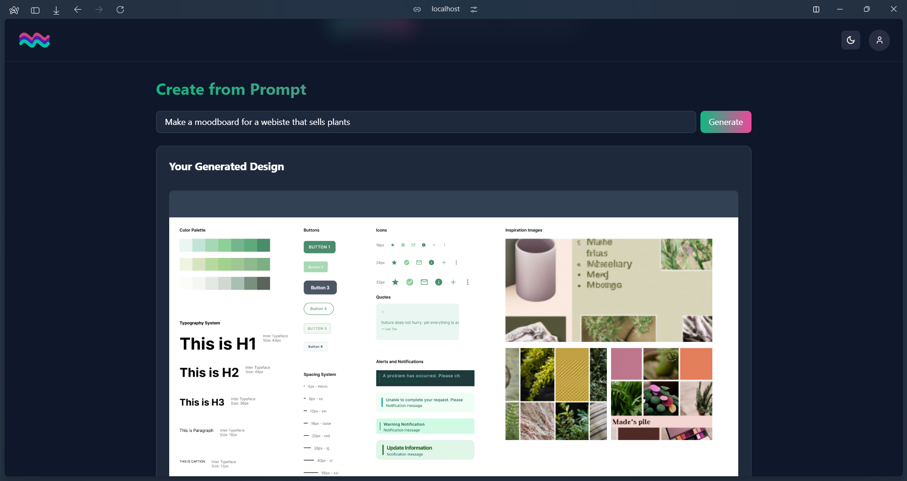 | 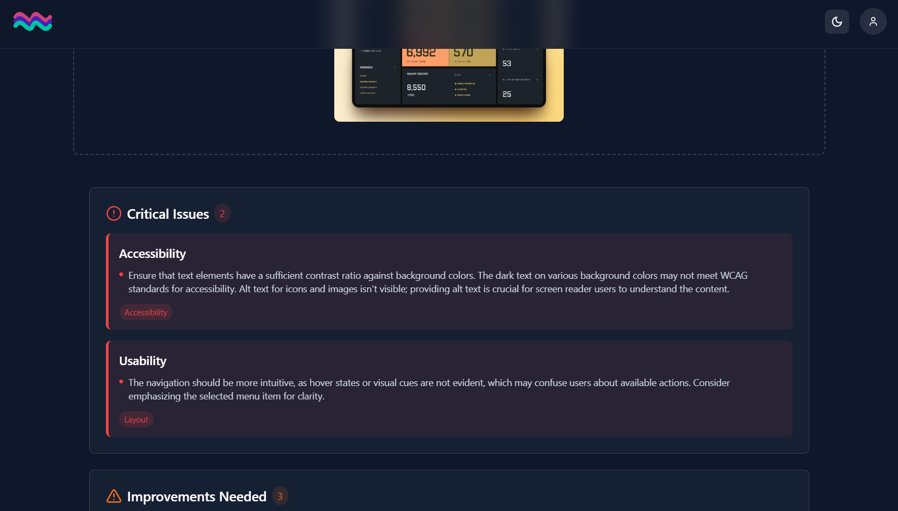 |

<br><br>

<!-- Database Design -->

Here you'll find our comprehensive database schema that outlines the structure and relationships of our application:

| Design Analysis                                    | Design Token History                                | User                                                |
|----------------------------------------------------|-----------------------------------------------------|-----------------------------------------------------|
| 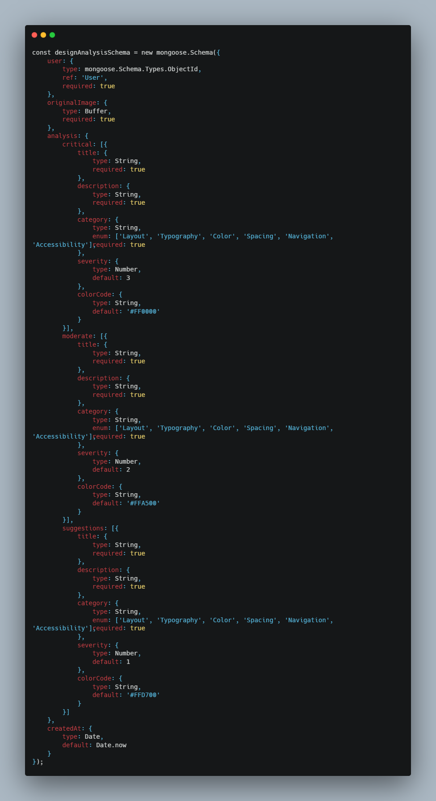 | 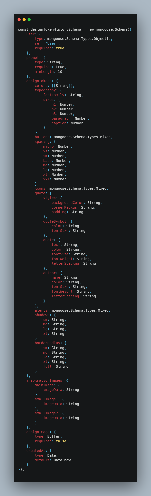 | 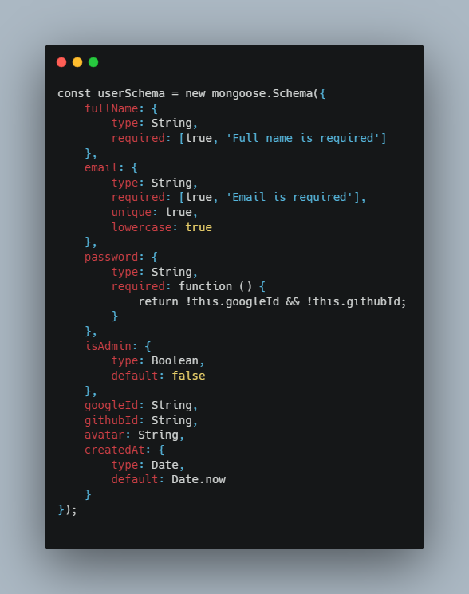 |

<br><br>

<!-- Implementation -->


### Feature Demonstrations

| Login Process                             | Admin Panel Overview                          |
|-------------------------------------------|-----------------------------------------------|
| 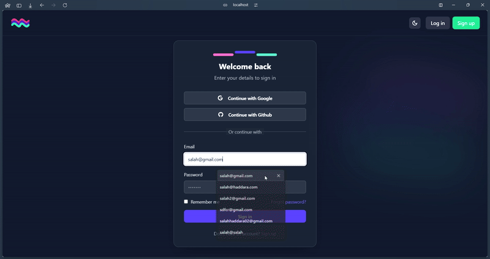 | 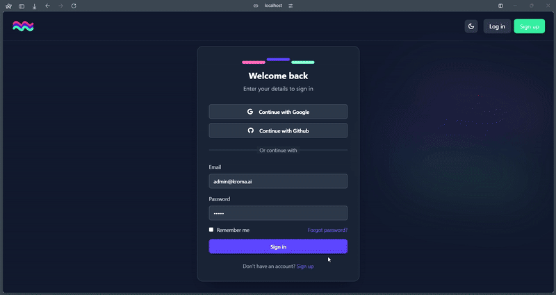 |

| Moodboard History                                          | Image to Moodboard Conversion                               |
|------------------------------------------------------------|-------------------------------------------------------------|
| 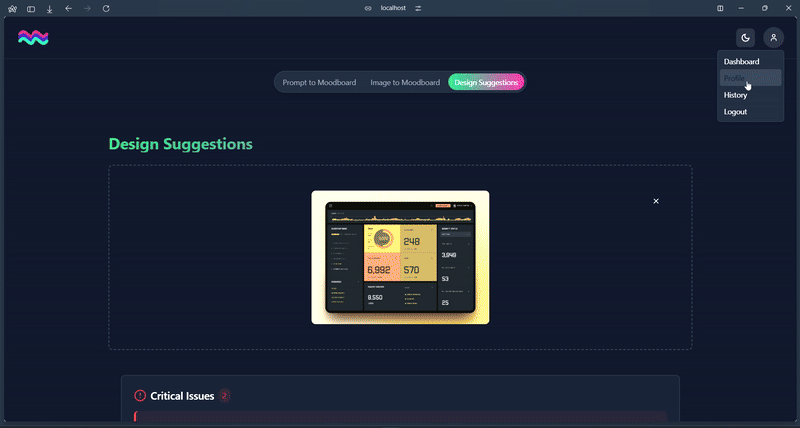 |  |

| Landing Page Navigation                         | Landing Page light                                          |
|-------------------------------------------------|-------------------------------------------------------------|
| 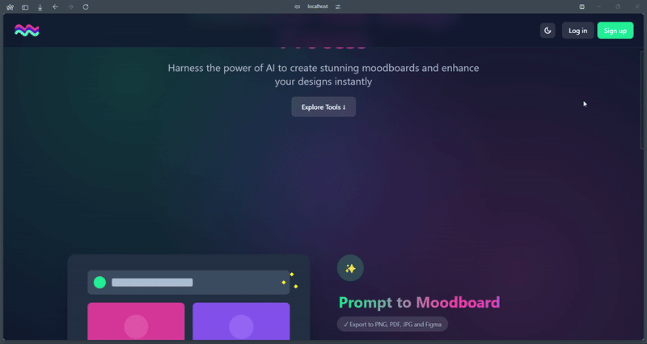 | 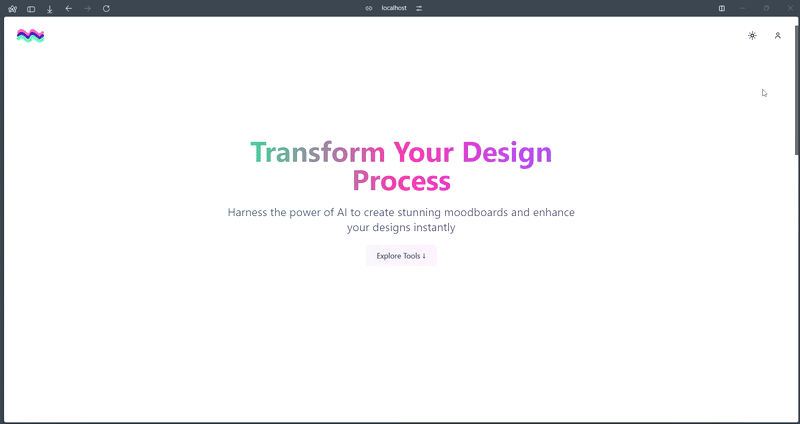 |

| Text Prompt to Moodboard                                      | UI Analysis Feature                           |
|---------------------------------------------------------------|-----------------------------------------------|
| 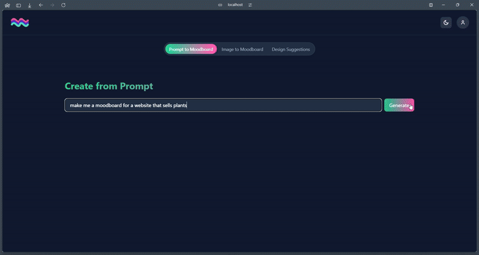 | 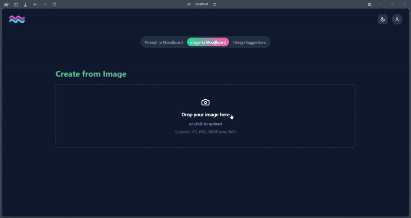 |

<!-- Prompt Engineering -->


### Mastering AI Interaction: Prompting Strategies for Design Intelligence

Here we showcase our carefully crafted prompts that power Kroma's AI capabilities:

| Design Generation                                     | UI/UX Analysis                                     |
|-------------------------------------------------------|----------------------------------------------------|
| 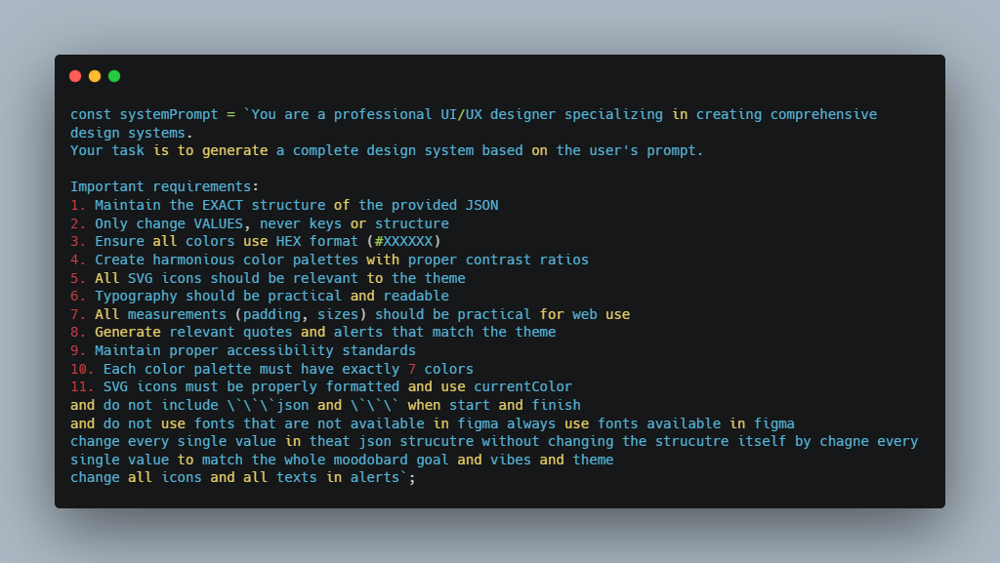 | 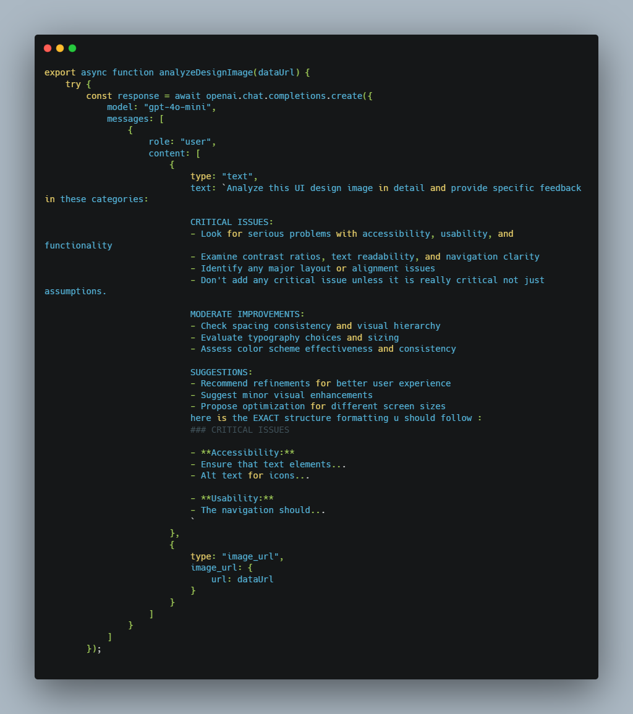 |

These prompts have been engineered to:

- Generate contextually relevant moodboards from text and image inputs
- Provide detailed UI/UX analysis with actionable insights
- Ensure consistent and high-quality design outputs
- Maintain brand cohesion while allowing for creative exploration

<!-- AWS Deployment -->


### AI Deployment Simplified: Enabling seamless integration and scalability with AWS

- This project shows you how to easily set up and run AI language models using AWS cloud services.
- We focus on making these AI systems work smoothly and handle more users as needed, ensuring they
- respond quickly and reliably for different business needs.

| Login                       | Sign Up                     |
|-----------------------------|-----------------------------|
| 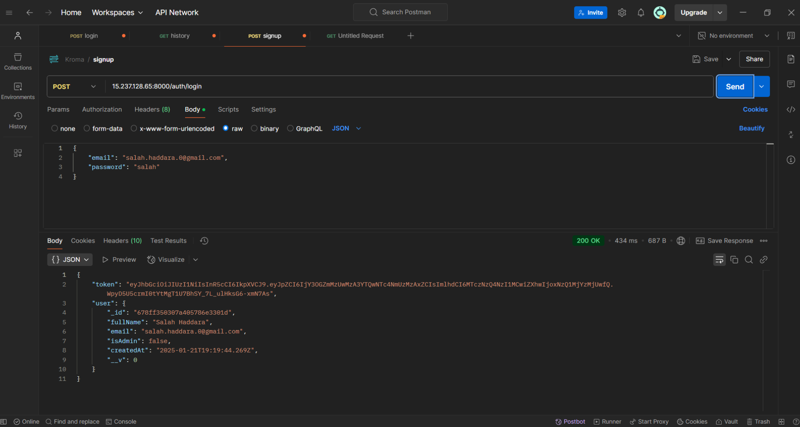 | 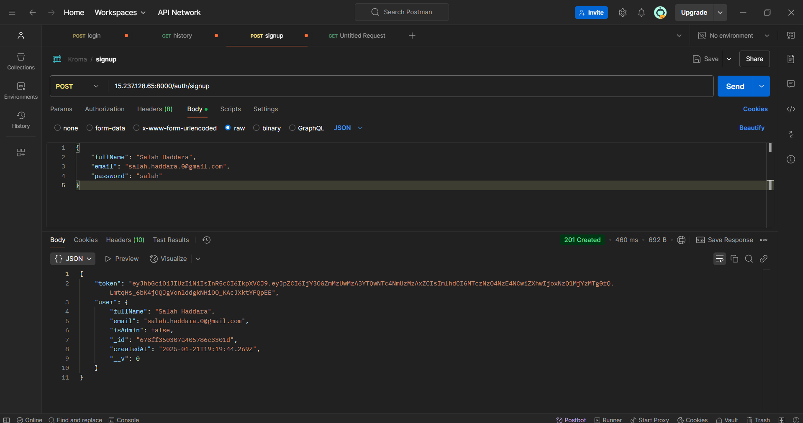 |

| Design Tokens               | Design Tokens               |
|-----------------------------|-----------------------------|
| 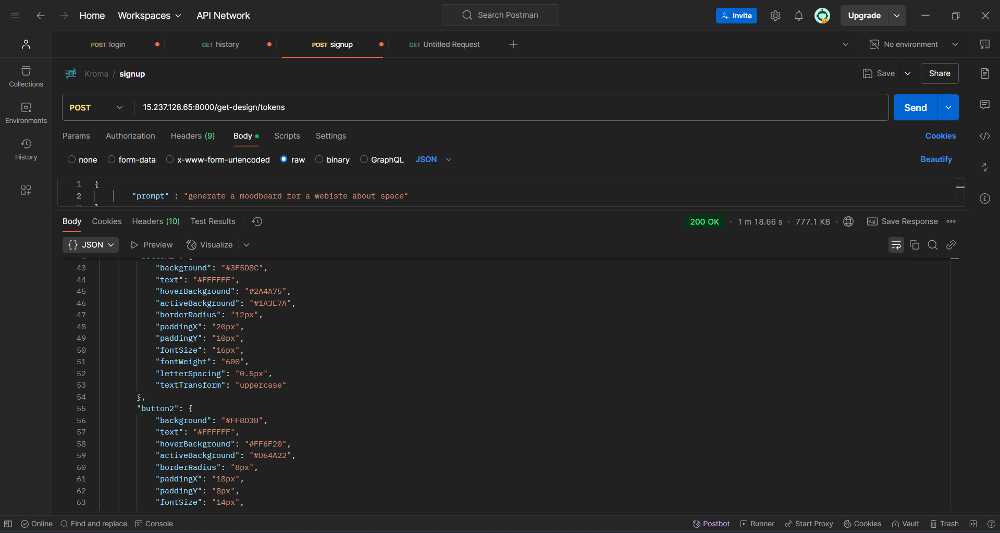 | 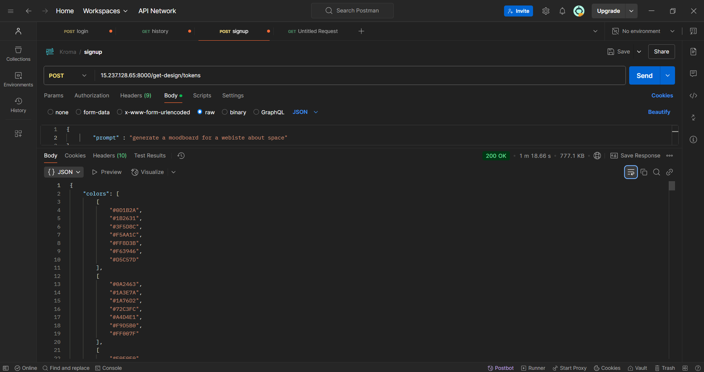 |

<br><br>


<!-- How to run -->


# Installation

1. Get an API Key at [OpenAI](https://openai.com/)

2. Clone the repo
   ```sh
   git clone https://github.com/yourusername/kroma.git
   ```

3. Install NPM packages
   ```sh
   cd kroma-server
   npm install
   ```

4. Create a .env file in the server directory:

   ```js
   PORT=3000
   NODE_ENV=development
   CORS_ORIGIN=http://localhost:5173

   OPENAI_API_KEY=your_openai_api_key

   MONGODB_URI=mongodb://127.0.0.1:27017/kroma
   JWT_SECRET=your_jwt_secret_key

   FRONTEND_URL=http://localhost:3000
   ```

5. Start the server
   ```sh
   npm start
   ```

6. Install frontend packages
   ```sh
   cd ../kroma-client
   npm install
   ```