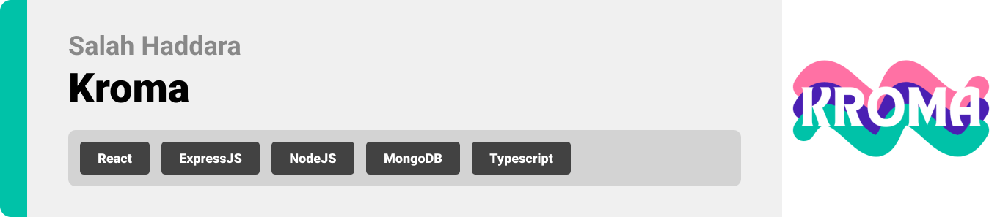

  
<!-- project philosophy -->

> An AI-powered tool for generating moodboards, integrating style suggestions and export functionality to streamline design workflows.

### User Stories

##User
- As a user, I want to make a moodboard for my new website, so I can type my prompt in the specified field and click generate to generate my moodboard.
- As a user, I want to generate a moodboard based on a screenshot, so I can upload the screenshot and click generate to generate the moodboard based on it.
- As a user, I want to improve my ui desing, so I can take upload my design and click generate to generate ai suggestions to ba made on my existing design.

##Admin
- As an admin, I want to view all users, so I can manage and monitor them effectively.
- As an admin, I want to view all moodboards generated, so I can oversee and analyze user activity.

  

<!-- Tech stack -->

### Kroma is built using the following technologies:

- This project uses the MERN stack ([MongoDB](https://www.mongodb.com), [Express.js](https://expressjs.com), [React.js](https://react.dev), [Node.js](https://nodejs.org)) to create a powerful and scalable web application. The stack enables seamless development of both frontend and backend components.
- For the frontend, [React.js](https://react.dev) powers our responsive interface, complemented by [Tailwind CSS](https://tailwindcss.com) for sleek styling and the [Figma Plugin API](https://www.figma.com/plugin-docs/intro) for direct integration with design workflows.
- The backend is built with [Node.js](https://nodejs.org) and [Express.js](https://expressjs.com), handling AI integrations and image processing. [MongoDB](https://www.mongodb.com) stores user data and moodboard configurations securely.
- For AI-powered features, we utilize [OpenAI's API](https://platform.openai.com) for natural language processing and image analysis, enabling intelligent moodboard generation and UI/UX suggestions.

  
<!-- UI UX -->

> We designed Kroma using wireframes and mockups, iterating on the design until we reached the ideal layout for easy navigation and a seamless user experience.

- Project Figma design [figma](https://www.figma.com/design/DB4LOvIG3xEt548dDFsCj6/Final-Project?node-id=0-1&t=bUJ6OSBLBBJbaxFR-1)

### Mockups
| Home screen  | Menu Screen | Order Screen |
| ---| ---| ---|
|  |  |  |

  
<!-- Database Design -->

